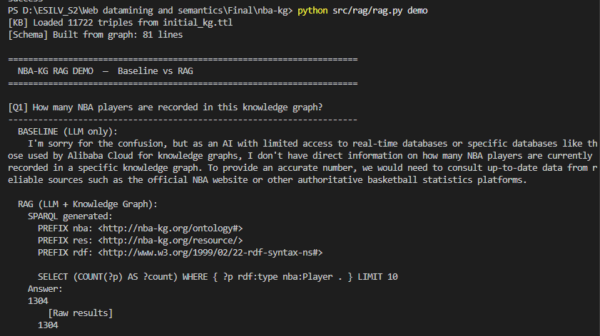
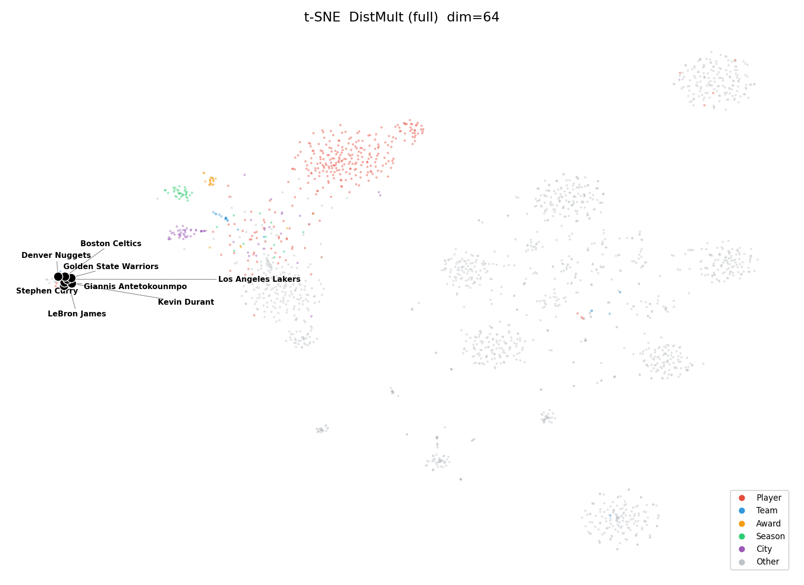
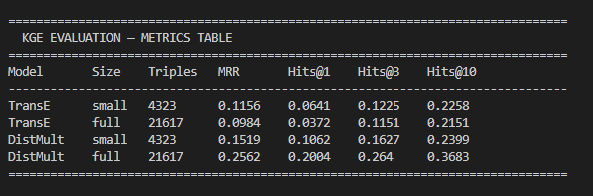

# NBA Knowledge Graph Pipeline

An end-to-end pipeline for constructing, enriching, and querying an NBA knowledge graph — from web crawling and named entity recognition through RDF/OWL modeling, entity alignment, SWRL reasoning, knowledge graph embeddings, and a retrieval-augmented generation (RAG) interface.

## Table of Contents

1. [Project Structure](#project-structure)
2. [Installation](#installation)
3. [Pipeline Overview](#pipeline-overview)
4. [How to Run](#how-to-run)
5. [Hardware Requirements](#hardware-requirements)
6. [KB Statistics](#kb-statistics)
7. [KGE Results](#kge-results)
8. [Demo & Results](#demo--results)

---

## Project Structure

```
nba-kg/
├── src/
│   ├── crawl/        # Web crawler and HTML cleaning
│   ├── ie/           # Named entity recognition (spaCy)
│   ├── kg/           # Ontology, RDF construction, alignment, SPARQL expansion
│   ├── reason/       # SWRL reasoning via OWLReady2
│   ├── kge/          # KGE training (TransE, DistMult) and evaluation
│   └── rag/          # RAG pipeline: NL → SPARQL, self-repair, CLI demo
├── data/
│   ├── raw/          # Crawler output (gitignored; see data/samples/)
│   ├── processed/    # extracted_knowledge.csv (NER output)
│   ├── kge/          # train.tsv / valid.tsv / test.tsv + stats.json
│   └── samples/      # Representative data samples for reproducibility
├── kg_artifacts/
│   ├── ontology.ttl  # OWL ontology
│   ├── initial_kg.ttl
│   ├── alignment.ttl # owl:sameAs links to Wikidata + DBpedia
│   └── expanded.nt   # SPARQL-expanded knowledge graph
├── reports/          # Final report PDF
├── requirements.txt
├── .gitignore
└── LICENSE
```

---

## Installation

Python 3.9+ is required.

```bash
pip install -r requirements.txt
python -m spacy download en_core_web_trf
```

For the RAG module, install [Ollama](https://ollama.com) and pull the language model:

```bash
ollama pull qwen2.5:3b
ollama serve          # starts the local API on http://localhost:11434
```

---

## Pipeline Overview

```
Web pages → Crawler → Cleaning → NER
                                  ↓
                          RDF/OWL Graph (initial_kg.ttl)
                                  ↓
                    Alignment (Wikidata / DBpedia) + SPARQL Expansion
                                  ↓
                    SWRL Reasoning (OWLReady2)
                                  ↓
                    KGE Training: TransE, DistMult (PyKEEN)
                                  ↓
                    RAG Demo: NL → SPARQL → Answer (Ollama + qwen2.5:3b)
```

---

## How to Run

Each step can be run independently. Run them in order for a full pipeline execution.

### 1. Data Acquisition and NER

```bash
python src/crawl/crawler.py    # crawl NBA-related pages
python src/crawl/clean.py      # clean and deduplicate HTML content
python src/ie/ner.py           # extract named entities (spaCy en_core_web_trf)
```

Output: `data/processed/extracted_knowledge.csv`

### 2. Knowledge Graph Construction

```bash
python src/kg/ontology.py      # define OWL classes and properties
python src/kg/build_kg.py      # build initial RDF graph from NER output
python src/kg/align.py         # align entities to Wikidata / DBpedia
python src/kg/expand.py        # expand KB via SPARQL queries to Wikidata
python src/kg/stats.py         # compute and save KB statistics
```

Output: `kg_artifacts/` directory

### 3. SWRL Reasoning

```bash
python src/reason/swrl_family.py   # run SWRL rules on family.owl (validation)
python src/reason/swrl_nba.py      # run SWRL rules on the NBA KB
```

### 4. Knowledge Graph Embeddings

```bash
python src/kge/prepare_data.py     # convert KG to train/valid/test splits
python src/kge/train.py            # train TransE and DistMult (2 sizes each)
python src/kge/evaluate.py         # metrics table + t-SNE + nearest neighbours
```

Output: `src/kge/results/` and `src/kge/figures/`

### 5. RAG Demo

Requires Ollama running with `qwen2.5:3b` (see [Installation](#installation)).

```bash
# Automated demo: 6 questions, Baseline vs RAG comparison
python src/rag/rag.py demo

# Interactive mode: enter your own natural-language questions
python src/rag/rag.py interactive
```

The demo compares a **baseline** (LLM-only, no KB access) against the **RAG pipeline** (LLM generates SPARQL → executes against the RDF graph → grounded answer). A self-repair loop (up to 3 attempts) corrects invalid SPARQL automatically.

---

## Hardware Requirements

| Component | Minimum | Recommended |
|-----------|---------|-------------|
| RAM | 8 GB | 16 GB |
| GPU | — | CUDA-compatible (speeds up KGE training) |
| Disk | 2 GB | 3 GB |
| Ollama model | qwen2.5:3b (~2 GB) | — |

---

## KB Statistics

| Entity Type   | Count  |
|---------------|--------|
| Players       | 1 304  |
| Teams         | 76     |
| Cities        | 274    |
| Seasons       | 195    |
| Awards        | 132    |
| **Initial KG triples** | **11 722** |
| **Expanded KG triples** | **49 741** |

KGE splits: **21 617** train / **2 702** valid / **2 702** test triples (27 021 relational triples total, 8 890 entities, 202 relation types)

---

## KGE Results

Four experiments: two models (TransE, DistMult) × two data sizes (small = 20%, full = 100%).

| Model    | Size  | Triples | MRR    | Hits@1 | Hits@3 | Hits@10 |
|----------|-------|---------|--------|--------|--------|---------|
| TransE   | small | 4 323   | 0.1156 | 0.0641 | 0.1225 | 0.2258  |
| TransE   | full  | 21 617  | 0.0984 | 0.0372 | 0.1151 | 0.2151  |
| DistMult | small | 4 323   | 0.1519 | 0.1062 | 0.1627 | 0.2399  |
| DistMult | full  | 21 617  | **0.2562** | **0.2004** | **0.2640** | **0.3683** |

DistMult (full) achieves the best performance across all metrics.

---

## Demo & Results

**RAG Demo — Baseline vs Knowledge Graph (Q1):**



**t-SNE Entity Embeddings — DistMult (full), coloured by ontology class:**



**KGE Evaluation Metrics Table:**


